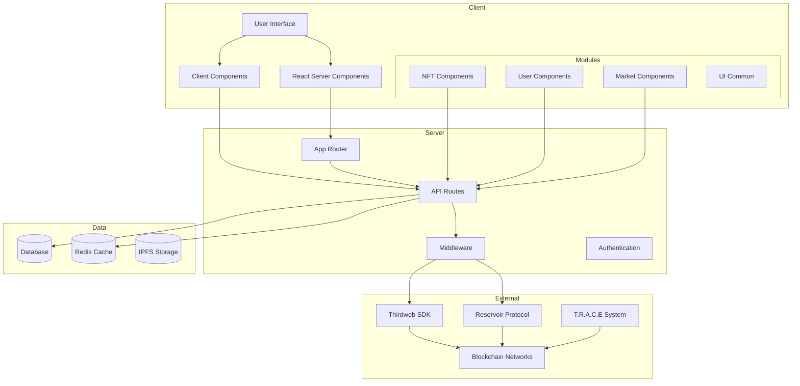

# Ikigai Labs XYZ

The platform is a comprehensive, non-custodial, open-source Web3 application, designed to empower creators and collectors while leveraging the advanced functionalities of Reservoir Tools and Thirdweb. Artists can securely mint, distribute, and sell their digital art across multiple chains, with smart contracts tailored through Transient Labs. By integrating Ikigai Labs' T.R.A.C.E. system, authenticity and provenance are guaranteed, ensuring transparency in each transaction. 

Curators play a pivotal role, crafting narratives and experiences through a seamless multi-chain aggregator that showcases over 150 marketplaces. Collectors are further engaged through innovative equity tokenization, offering them shared ownership and deeper community involvement. The platform not only supports digital art transactions but fosters a dynamic, evolving ecosystem where creators, curators, and collectors thrive. The concept of 'ikigai' guides this vision, blending technology, innovation, and passion to nurture both digital and physical art spaces through residencies and real-world experiences. 

## System Architecture



## Project Structure

```
ikigailabs.xyz/
├── modules/                # Feature-based components
│   ├── NFT/               # NFT-related components
│   │   ├── TokenCard
│   │   ├── TokenMedia
│   │   └── TokenActivity
│   ├── Market/            # Marketplace components
│   │   ├── ListingsList
│   │   ├── OffersList
│   │   └── MarketStats
│   ├── User/              # User-related components
│   │   ├── Profile
│   │   ├── UserBids
│   │   └── UserAsks
│   └── Common/            # Shared components
│       ├── Header
│       ├── Footer
│       └── Modal
├── pages/                 # Next.js pages
├── styles/                # Global styles and Tailwind
├── lib/                   # Utilities and configurations
├── public/               # Static assets
└── common/               # Shared utilities and types
```

## Features

- **NFT Trading & Management**
  - Token Media Viewer with support for multiple formats
  - Real-time pricing and advanced filtering
  - Multi-chain support (Ethereum, Polygon, Base, Zora)
  - Batch minting and listing capabilities
  - Token activity tracking and history
  
- **Market Features**
  - Real-time listings and offers
  - Market statistics and analytics
  - Collection insights and trends
  - Bulk bidding and listing tools
  
- **User Experience**
  - Profile management and portfolio tracking
  - Customizable notifications and alerts
  - Bid/Ask management interface
  - Activity history and analytics
  
- **Platform Infrastructure**
  - React Server Components for optimal rendering
  - Edge Runtime support for API routes
  - Multi-chain transaction support
  - IPFS integration for decentralized storage

## Core Modules

### NFT Module
- `TokenCard`: Displays NFT preview with key metadata
- `TokenMedia`: Handles various media formats (image, video, 3D)
- `TokenActivity`: Shows token history and transactions
- `NFTGrid`: Responsive grid layout for token display

### Market Module
- `ListingsList`: Active market listings view
- `OffersList`: Current offers and bid management
- `MarketStats`: Real-time market statistics
- `CreateOffer`: Offer creation interface

### User Module
- `Profile`: User profile and settings
- `UserBids`: Active and historical bids
- `UserAsks`: Listed items management
- `UserActivity`: Transaction history

### Common Components
- `Header`: Navigation and wallet connection
- `Footer`: Site information and links
- `Modal`: Reusable modal component
- `Search`: Global search functionality

## Technologies

- Next.js 13+ with App Router
- React 18+
- TypeScript
- Shadcn UI
- Radix UI
- Tailwind CSS
- Reservoir Tools
- Thirdweb SDK

## Dependencies

Our project relies on several key dependencies to function. Here's an overview of the main packages used:

- `next`: ^13.4.7 - The React framework for production.
- `react`: ^18.2.0 - A JavaScript library for building user interfaces.
- `react-dom`: ^18.2.0 - React package for working with the DOM.
- `@reservoir0x/reservoir-kit-ui`: ^1.0.1 - UI components for Reservoir protocol integration.
- `@thirdweb-dev/react`: ^3.14.40 - React hooks and components for Thirdweb integration.
- `@thirdweb-dev/sdk`: ^3.10.59 - Thirdweb SDK for interacting with smart contracts.
- `ethers`: ^5.7.2 - Library for interacting with Ethereum.
- `nuqs`: ^1.11.0 - Next.js URL Query State management.
- `tailwindcss`: ^3.3.2 - A utility-first CSS framework.
- `typescript`: ^5.1.5 - TypeScript language support.

For a complete list of dependencies and their versions, please refer to the `package.json` file in the project root.

## Getting Started

These instructions will help you set up and run the project on your local machine.

### Prerequisites

- Node.js (version X.X.X or higher)
- npm or yarn
- Thirdweb SDK
- Reservoir API key

### Installation

1. Clone the repository:
   ```bash
   git clone https://github.com/IkigaiLabsETH/ikigailabs.xyz.git
   ```

2. Navigate to the project directory:
   ```bash
   cd project
   ```

3. Install dependencies:
   ```bash
   npm install
   # or
   yarn install
   ```

4. Set up environment variables:
   Copy the `.env.example` file to `.env` and fill in the required values, including your Reservoir API key and Thirdweb project settings.

## Usage

To start the development server:

1. Ensure you're in the project directory.

2. Run one of the following commands:

   ```bash
   npm run dev
   # or
   yarn dev
   # or
   pnpm dev
   ```

3. Open [http://localhost:3000](http://localhost:3000) in your browser to view the application.

The server will automatically reload if you make changes to the source files. You'll see any lint errors in the console.

For production, build the application first: yarn build

## App Architecture

Key architectural decisions:
- Extensive use of React Server Components for improved performance
- Client Components wrapped in Suspense with fallbacks
- URL state management with `nuqs`
- Mobile-first responsive design with Tailwind CSS
- Optimized image handling with Next.js Image component

Our application follows a modular and organized structure to enhance maintainability and scalability. Here's an overview of the main directories and their purposes:

- `/app`: Next.js 13+ App Router structure
  - `/api`: API routes
  - `/[locale]`: Internationalized routes
- `/components`: Reusable UI components
  - `/ui`: Shadcn UI components
- `/hooks`: Custom React hooks
- `/lib`: Utility functions and configurations
- `/modules`: Feature-specific modules
  - `/collections`: Collection-related functionality
    - `page.tsx`: Server Component for collections page
    - `collections-grid.tsx`: Client Component for rendering collections
    - `use-collections.ts`: Custom hook for collection data
- `/providers`: Context providers for state management
- `/public`: Static assets
- `/styles`: Global styles and Tailwind configuration
- `/types`: TypeScript type definitions and interfaces

This structure allows for easy navigation, separation of concerns, and scalability as the project grows.

## API Reference

Our application leverages both Reservoir and Thirdweb APIs, as well as custom endpoints. Here's an overview of key API endpoints:

### Reservoir Endpoints

1. Get Collections
   ```
   GET /api/reservoir/collections
   ```
   Fetches a list of NFT collections using Reservoir's API.

2. Get Collection Details
   ```
   GET /api/reservoir/collections/{collectionId}
   ```
   Retrieves detailed information about a specific collection.

3. Get Tokens
   ```
   GET /api/reservoir/tokens
   ```
   Fetches NFT tokens based on specified filters.

### Thirdweb Endpoints

1. Get Contract Metadata
   ```
   GET /api/thirdweb/contract/{contractAddress}
   ```
   Retrieves metadata for a specific smart contract.

2. Create Listing
   ```
   POST /api/thirdweb/marketplace/create-listing
   ```
   Creates a new NFT listing on the marketplace.

### Custom Endpoints

1. User Authentication
   ```
   POST /api/auth/login
   POST /api/auth/logout
   GET /api/auth/user
   ```
   Handles user authentication and retrieval of user data.

2. Marketplace Activity
   ```
   GET /api/activity
   ```
   Fetches recent marketplace activity, combining data from Reservoir and on-chain events.

For detailed parameters and response formats, please refer to our API documentation.

## Contributing

1. Fork the repository
2. Create your feature branch (`git checkout -b feature/AmazingFeature`)
3. Commit your changes (`git commit -m 'Add some AmazingFeature'`)
4. Push to the branch (`git push origin feature/AmazingFeature`)
5. Open a Pull Request

## License

This project is licensed under the [MIT License](LICENSE).


## Next.js

To learn more about Next.js, take a look at the following resources:

- [Next.js Documentation](https://nextjs.org/docs) - learn about Next.js features and API.
- [Learn Next.js](https://nextjs.org/learn) - an interactive Next.js tutorial.

You can check out [the Next.js GitHub repository](https://github.com/vercel/next.js/) - your feedback and contributions are welcome!

## Vercel

The easiest way to deploy your Next.js app is to use the [Vercel Platform](https://vercel.com/new?utm_medium=default-template&filter=next.js&utm_source=create-next-app&utm_campaign=create-next-app-readme) from the creators of Next.js.

Check out our [Next.js deployment documentation](https://nextjs.org/docs/deployment) for more details.

## Performance Optimization

- **Server Components**: Extensive use of React Server Components reduces client-side JavaScript
- **Edge Runtime**: API routes deployed to the edge for minimal latency
- **Caching Strategy**:
  - Static paths generation for collection pages
  - Incremental Static Regeneration for dynamic data
  - Redis caching for API responses
- **Image Optimization**:
  - WebP/AVIF format delivery
  - Automatic responsive images
  - Lazy loading implementation

## Security Measures

- **Smart Contract Security**:
  - Audited contract templates
  - Multi-signature support
  - Automated vulnerability scanning
- **API Security**:
  - Rate limiting
  - CORS configuration
  - Input validation
- **User Protection**:
  - Non-custodial wallet integration
  - Transaction signing confirmation
  - Fraud detection systems

## Performance Optimization Guide

### 1. Server-Side Optimizations

#### React Server Components (RSC)
- Convert data-fetching components to RSC
- Move heavy computations to the server
- Keep client components minimal and focused on interactivity
```typescript
// Before
export default function CollectionGrid() {
  const [data, setData] = useState()
  useEffect(() => {
    fetchData()
  }, [])
  return <Grid data={data} />
}

// After
export default async function CollectionGrid() {
  const data = await fetchData() // Server-side
  return <Grid data={data} />
}
```

#### Route Segmentation
- Implement parallel routes for independent data fetching
- Use loading.tsx for streaming
- Leverage generateStaticParams for static paths
```typescript
// app/collection/[slug]/loading.tsx
export default function Loading() {
  return <CollectionSkeleton />
}

// app/collection/[slug]/page.tsx
export async function generateStaticParams() {
  const collections = await getTopCollections()
  return collections.map((c) => ({ slug: c.slug }))
}
```

### 2. Data Fetching & Caching

#### Reservoir API Optimization
- Implement cursor-based pagination
- Use field selection to minimize response size
- Cache common queries with Redis
```typescript
// lib/cache.ts
export async function getCachedCollections() {
  const cached = await redis.get('top_collections')
  if (cached) return JSON.parse(cached)
  
  const data = await fetchCollections()
  await redis.setex('top_collections', 300, JSON.stringify(data))
  return data
}
```

#### Dynamic Data Strategy
- Use SWR for real-time data with optimistic updates
- Implement infinite loading for large lists
- Cache invalidation based on blockchain events
```typescript
// hooks/useCollectionData.ts
export function useCollectionData(slug: string) {
  return useSWR(
    ['collection', slug],
    () => fetchCollectionData(slug),
    {
      revalidateOnFocus: false,
      dedupingInterval: 10000,
    }
  )
}
```

### 3. Client-Side Optimizations

#### Bundle Size Reduction
- Implement route-based code splitting
- Lazy load non-critical components
- Tree shake unused dependencies
```typescript
// Dynamic imports for heavy components
const TokenMedia = dynamic(() => import('@/modules/NFT/TokenMedia'), {
  loading: () => <MediaSkeleton />,
  ssr: false
})
```

#### Asset Optimization
- Use next/image with priority for LCP images
- Implement responsive images with srcset
- Convert animations to CSS where possible
```typescript
// components/NFTCard.tsx
export function NFTCard({ image }) {
  return (
    <Image
      src={image}
      alt="NFT"
      width={300}
      height={300}
      priority={true}
      sizes="(max-width: 768px) 100vw, 300px"
    />
  )
}
```

### 4. State Management

#### URL State Management
- Use URL state for shareable filters
- Implement debounced updates
- Minimize client-side state
```typescript
// hooks/useFilterState.ts
export function useFilterState() {
  const [searchParams, setSearchParams] = useSearchParams()
  const debouncedSetParams = useDebouncedCallback(
    (params) => setSearchParams(params),
    300
  )
}
```

#### Memory Management
- Implement virtualization for long lists
- Clean up subscriptions and event listeners
- Use weak references for large objects
```typescript
// components/TokenGrid.tsx
export function TokenGrid({ tokens }) {
  return (
    <VirtualizedGrid
      data={tokens}
      rowHeight={300}
      overscan={5}
      renderItem={(token) => <TokenCard token={token} />}
    />
  )
}
```

### 5. Infrastructure Optimization

#### Edge Runtime
- Deploy API routes to edge locations
- Use streaming responses for large datasets
- Implement stale-while-revalidate caching
```typescript
// app/api/collections/route.ts
export const runtime = 'edge'

export async function GET() {
  const cached = await cache.get('collections')
  if (cached) {
    revalidateData() // Background revalidation
    return new Response(cached)
  }
  // ... fetch and cache data
}
```

#### CDN Configuration
- Configure Vercel for optimal asset delivery
- Use persistent caching for static assets
- Implement cache warming for popular routes

### 6. Monitoring & Metrics

#### Performance Monitoring
- Implement Web Vitals tracking
- Set up error boundary monitoring
- Track and optimize API response times
```typescript
// lib/monitoring.ts
export function reportWebVitals(metric) {
  if (metric.name === 'LCP') {
    console.log('LCP:', metric.value)
    // Send to analytics
  }
}
```

### Implementation Priority

1. **Immediate Wins**
   - Convert data-heavy components to RSC
   - Implement proper image optimization
   - Add Redis caching for common queries

2. **Short-term Improvements**
   - Set up edge runtime for API routes
   - Implement virtualization for long lists
   - Optimize bundle size

3. **Long-term Optimization**
   - Set up comprehensive monitoring
   - Implement advanced caching strategies
   - Optimize infrastructure configuration
