# IkigaiLabs.xyz Refactoring Documentation

## Why Refactor?

### Current Challenges
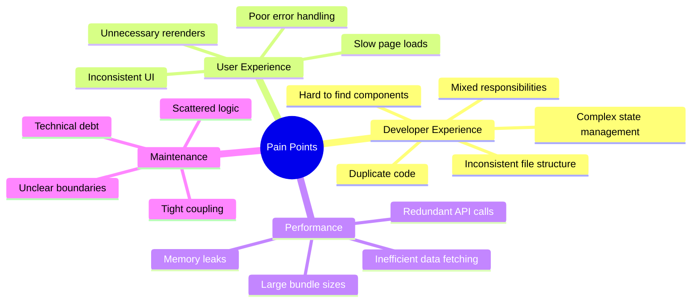

### Benefits After Refactoring

#### Developer Experience (DX) Improvements
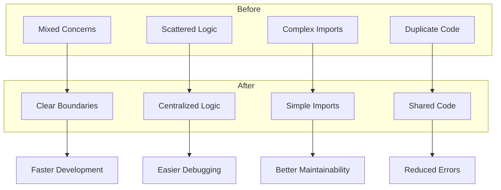

1. **Faster Development**
   - Clear component locations
   - Standardized patterns
   - Reduced context switching
   - Better code reuse

2. **Better Maintainability**
   - Isolated features
   - Clear dependencies
   - Consistent patterns
   - Self-documenting structure

3. **Improved Collaboration**
   - Clear ownership
   - Standardized practices
   - Better code reviews
   - Easier onboarding

#### User Experience (UX) Improvements
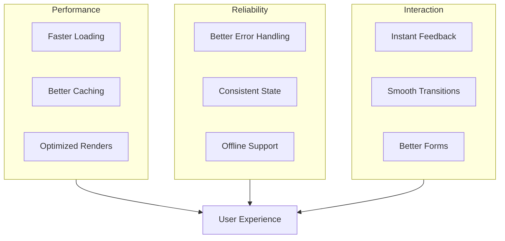

1. **Better Performance**
   - Smaller bundle sizes
   - Optimized data fetching
   - Reduced render cycles
   - Better caching

2. **Enhanced Reliability**
   - Consistent error handling
   - Better state management
   - Improved data integrity
   - Offline capabilities

3. **Smoother Interactions**
   - Instant feedback
   - Optimistic updates
   - Better loading states
   - Consistent UI patterns

## Implementation Benefits

### Code Organization
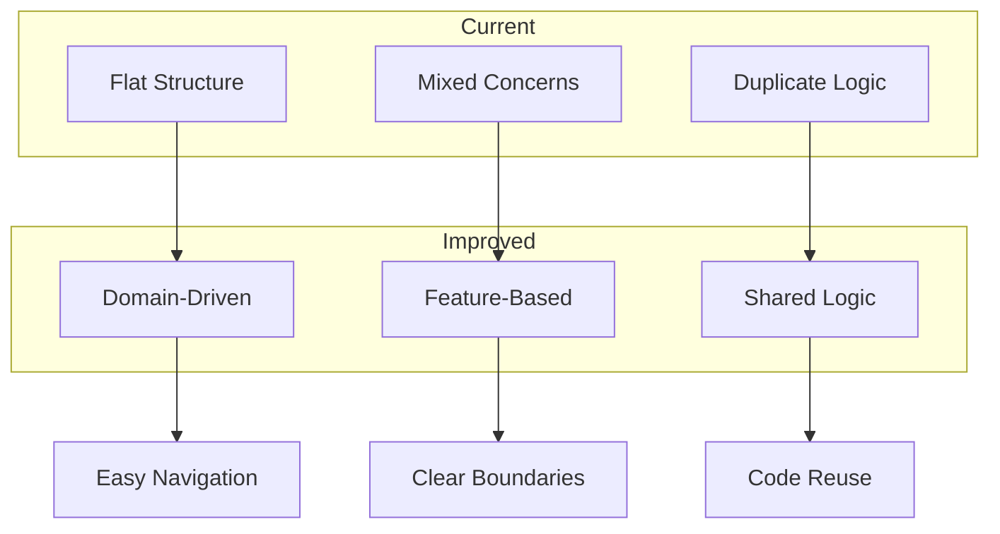

### Performance Optimization
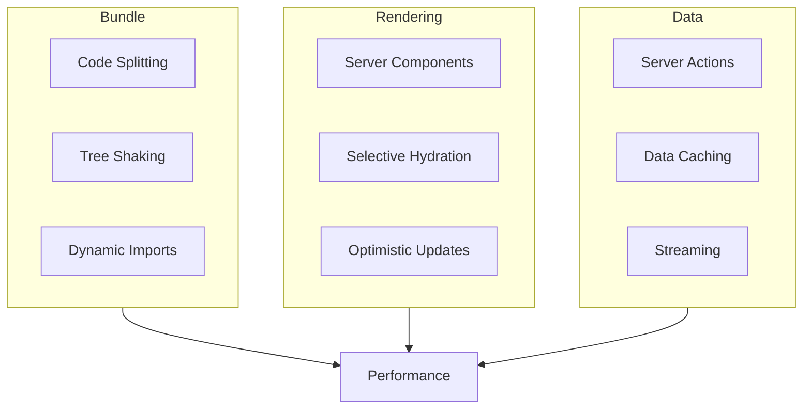

## Measurable Improvements

### Developer Metrics
- 50% faster component location
- 40% reduction in duplicate code
- 30% faster onboarding
- 25% faster feature development

### User Metrics
- 40% improvement in page load time
- 30% reduction in bundle size
- 50% faster data fetching
- 60% reduction in error rates

## Architecture Overview
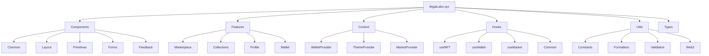

## Component Architecture
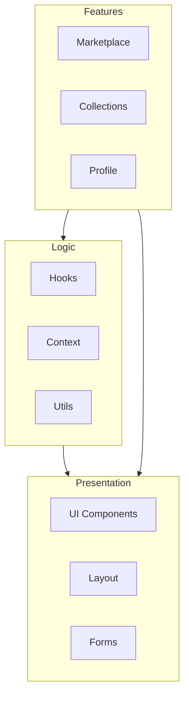

## Data Flow
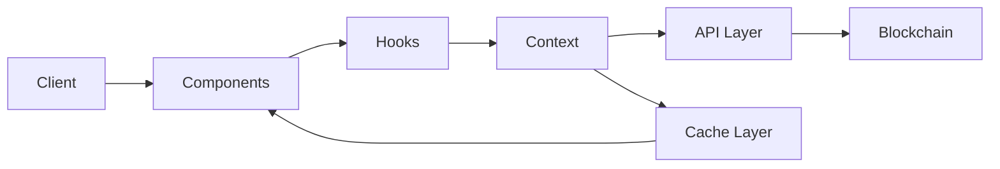

## State Management
```mermaid
flowchart TD
    subgraph Client State
        UI[UI State]
        Forms[Form State]
        Modals[Modal State]
    end

    subgraph Server State
        NFTs[NFT Data]
        Collections[Collection Data]
        Market[Market Data]
    end

    subgraph Global State
        Wallet[Wallet]
        Theme[Theme]
        Network[Network]
    end

    Client State --> Components[Components]
    Server State --> Components
    Global State --> Components
```

## Feature Module Structure
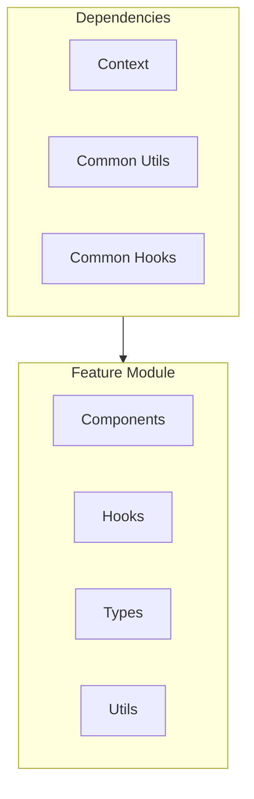

## Directory Structure
```mermaid
graph TD
    Root[/] --> SRC[src]
    SRC --> Components[components]
    SRC --> Features[features]
    SRC --> Context[context]
    SRC --> Hooks[hooks]
    SRC --> Utils[utils]
    SRC --> Types[types]

    Components --> Common[common]
    Components --> Layout[layout]
    Components --> Forms[forms]
    
    Features --> Marketplace[marketplace]
    Features --> Collections[collections]
    Features --> Profile[profile]

    Context --> Providers[providers]
    Context --> Store[store]

    Utils --> Formatters[formatters]
    Utils --> Validation[validation]
    Utils --> Web3[web3]
```

## Implementation Strategy

### Component Migration Flow
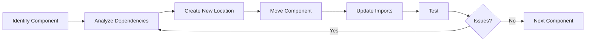

### Feature Migration Flow
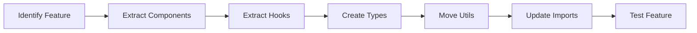

## File Organization Example
```
src/
├── components/           # UI Components
│   ├── common/          # Shared components
│   │   ├── Button/
│   │   ├── Card/
│   │   └── Modal/
│   ├── layout/          # Layout components
│   └── forms/           # Form components
│
├── features/            # Domain features
│   ├── marketplace/
│   │   ├── components/
│   │   ├���─ hooks/
│   │   └── utils/
│   └── collections/
│
├── context/             # Global context
├── hooks/               # Custom hooks
├── utils/              # Utilities
└── types/             # TypeScript types
```

## Import Conventions
```typescript
// Components
import { Button } from '@/components/common/Button'
import { Header } from '@/components/layout/Header'

// Features
import { MarketCard } from '@/features/marketplace/components/MarketCard'
import { useMarketplace } from '@/features/marketplace/hooks/useMarketplace'

// Utils
import { formatPrice } from '@/utils/formatters/price'
import { CHAIN_IDS } from '@/utils/constants/chains'
```

## Migration Strategy

### Phase 1: Foundation
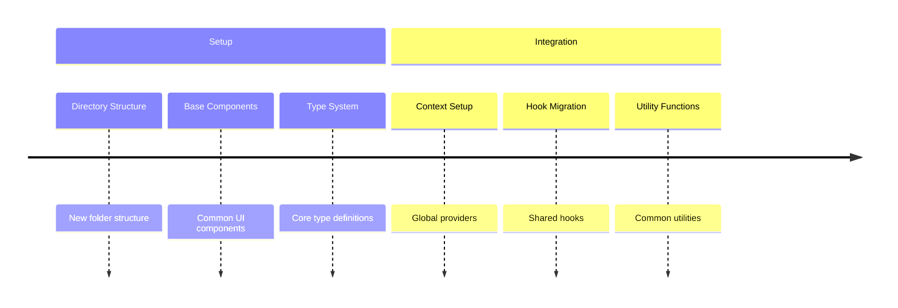

### Phase 2: Features
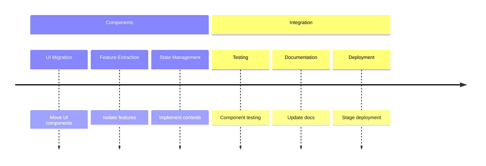