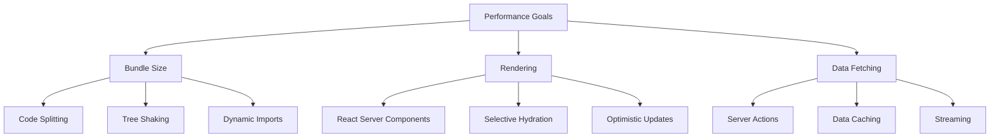
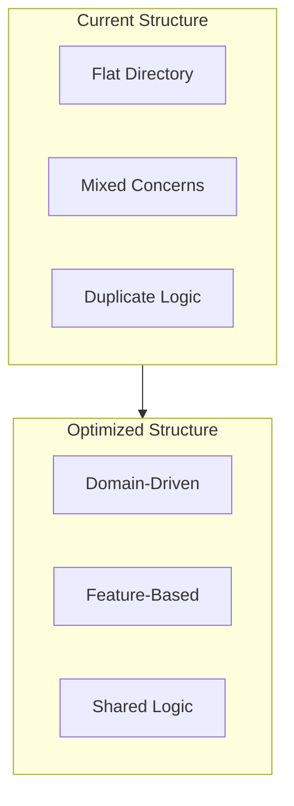
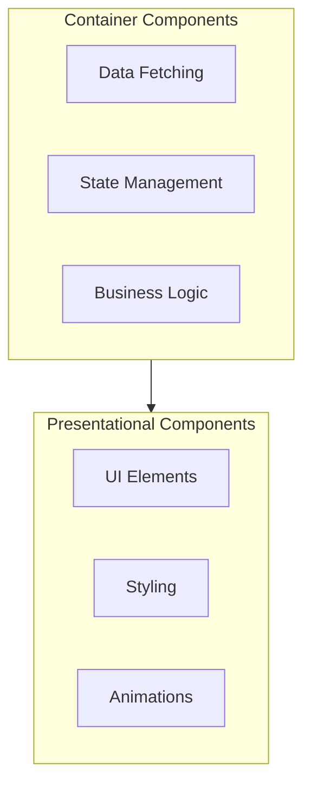

# IkigaiLabs.xyz Refactoring Documentation

## Overview
This document outlines the refactoring process for IkigaiLabs.xyz, focusing on improving code organization, maintainability, and scalability. The refactoring aims to establish a more structured and modular codebase that better reflects our domain-driven design approach.

## Why Refactor?

### Current Pain Points
1. **Performance Issues**
   - Large bundle sizes due to unoptimized imports
   - Unnecessary re-renders in NFT components
   - Inefficient data fetching patterns

2. **Technical Debt**
   - Mixed concerns in component logic
   - Duplicated code across NFT features
   - Inconsistent state management patterns

3. **Developer Experience**
   - Difficulty in locating related code
   - Unclear component responsibilities
   - Inconsistent coding patterns

### Optimization Goals

#### 1. Performance Optimization


#### 2. Code Organization


## Implementation Strategy

### 1. Performance Optimizations

#### Bundle Size Reduction
- Implement route-based code splitting
- Use dynamic imports for heavy components
- Optimize image loading with next/image
```typescript
// Before
import { NFTCard } from '@/modules/NFTCard'

// After
const NFTCard = dynamic(() => import('@/modules/nft/core/NFTCard'))
```

#### Server Components
- Convert non-interactive components to RSC
- Use streaming for dynamic content
```typescript
// Before
'use client'
export function NFTGrid({ tokens }) {
  return <div>{tokens.map(token => <NFTCard token={token} />)}</div>
}

// After
export async function NFTGrid({ tokens }) {
  return (
    <Suspense fallback={<NFTGridSkeleton />}>
      {tokens.map(token => <NFTCard token={token} />)}
    </Suspense>
  )
}
```

#### Data Fetching
- Implement server actions for mutations
- Use React Query for client-side caching
```typescript
// Before
const fetchNFTs = async () => {
  const res = await fetch('/api/nfts')
  return res.json()
}

// After
export async function fetchNFTs() {
  return unstable_cache(
    async () => {
      const nfts = await db.nfts.findMany()
      return nfts
    },
    ['nfts'],
    { revalidate: 60 }
  )()
}
```

### 2. State Management Optimization

#### Client State
- Use Zustand for global UI state
- Implement atomic state patterns
```typescript
// Before
const [nfts, setNfts] = useState([])
const [loading, setLoading] = useState(false)
const [error, setError] = useState(null)

// After
interface NFTStore {
  nfts: NFTToken[]
  loading: boolean
  error: Error | null
  fetch: () => Promise<void>
}

const useNFTStore = create<NFTStore>((set) => ({
  nfts: [],
  loading: false,
  error: null,
  fetch: async () => {
    set({ loading: true })
    try {
      const nfts = await fetchNFTs()
      set({ nfts, loading: false })
    } catch (error) {
      set({ error, loading: false })
    }
  }
}))
```

#### Server State
- Implement React Query for data fetching
- Use optimistic updates for better UX
```typescript
const useNFTs = () => {
  return useQuery({
    queryKey: ['nfts'],
    queryFn: fetchNFTs,
    staleTime: 1000 * 60 * 5
  })
}
```

### 3. Component Architecture

#### Smart vs Presentational


#### Component Composition
```typescript
// Before
function NFTCard({ token, onBuy, onOffer }) {
  // Mixed concerns
}

// After
function NFTCard({ token }: { token: NFTToken }) {
  return (
    <Card>
      <NFTMedia token={token} />
      <NFTInfo token={token} />
      <NFTActions token={token} />
    </Card>
  )
}
```

## Monitoring and Metrics

### Performance Metrics
- First Contentful Paint (FCP)
- Largest Contentful Paint (LCP)
- Time to Interactive (TTI)
- Cumulative Layout Shift (CLS)

### Implementation Metrics
- Bundle size reduction
- Component render times
- API response times
- Cache hit rates

## Migration Path

### Phase 1: Foundation
1. Set up new directory structure
2. Implement core type system
3. Create shared utilities

### Phase 2: Components
1. Migrate core components
2. Implement NFT module
3. Set up marketplace features

### Phase 3: Optimization
1. Convert to server components
2. Implement data fetching strategy
3. Optimize bundle sizes

### Phase 4: Monitoring
1. Set up performance monitoring
2. Implement error tracking
3. Add usage analytics

## Best Practices

### Code Quality
- Use TypeScript strict mode
- Implement ESLint rules
- Add Prettier configuration
- Set up Husky pre-commit hooks

### Testing Strategy
- Unit tests for utilities
- Integration tests for features
- E2E tests for critical paths
- Performance testing

### Documentation
- Component documentation
- API documentation
- State management patterns
- Performance guidelines